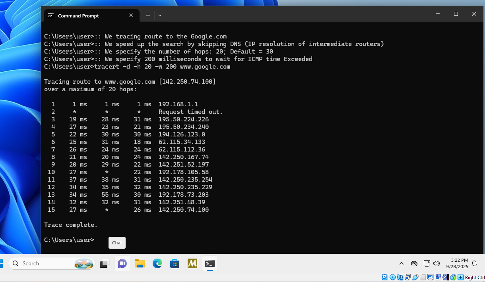

<div align="center">

# Tracert Command  
## Windows 11 Pro Administration Guide

<div>

| **Name**      | Sergei Ivanov          |
|---------------|------------------------|
| **Major**     | IT Systems Development |
| **Instructor**| Pavel Kodotsigov       |
| **University** | University of Tartu   |

</div>

**A comprehensive overview of the tracert command for network diagnostics.**

28.09.2025
</div>

---


## Table of Content

- [Introduction](#introduction)
- [Purpose](#purpose)
- [How to use](#how-to-use)
    - [Syntax](#syntax)
    - [Table of parameters](#table-of-parameters)
    - [Advanced Example](#advanced-example)
- [Sources of Information](#sources-of-information)

## Introduction

Both on Windows and Linux we can use command terminal tools to administrate the OS. Specifically, this guide features the **tracert** command on Windows. 
On Linux, there is similar command **traceroute**. The command *tracert* helps the adminstrator or a user to trace the route of the packet going through
the network. For example,


### Example

Open up your terminal. You can do so by typing ***cmd** to the search input; then click right onto it and the terminal window will pop up.

```
tracert www.google.com
```

and wait for a while. I would like to show both VM interface and the running Windows 11 Pro VM:


Then I show you the example in the VM:


The result shows to you which way and how your signal navigated across the network to arrive at Google's router (we can see 15 hops on the picture!).

> A hop is an intermediary component of the network. How many routers, switches did my packet go through.

My packet of data came from Host IP (my machine) - because my VM uses Host machine - all the way to the Google router, while also having passed through my Internet Provider hops. Under the hood, `tracert` uses ICMP protocol with increasing **TTL** (Time to live). Routers decrease the `TTL` and when it reaches the 0 value, Router sends the ICMP Timeexceeded; which is how `traceroute` (or `tracert`) learn about each `hop` (Wikipedia, 2025, traceroute, Implementations, 7 paragraph). In other words, my machine increases the TTL, whereas the routers always decrease it - this is how tracert knows about hops. 

> Please, notice that `::` is the way to write comments in the `Batch` language; You can see `REM` too or `@rem` to write comments.

Let us try different example:


You can see the IP address of Narva College website (Resolve by DNS server). We can see the 7 hops and the ones marked with `*` sign indicates that they did not return the *TimeExceeded* response (TTL = 0). It happens and is completely normal: some routers block the ICMP or drop the traceroute packets. Put simply, some routers did not respond to ICMP.

Each row contains:

- Hop number
- Round-trip times
- IP Address 

After, you can notice the intermediate ISP routers, for example:

```
3    19 ms    20 ms    26 ms  242-224-50-195.sta.estpak.ee [195.50.224.242]
```

- shows the next-level ISP hops that the packet has traversed;
- it can be observed that latency increases gradually (in other words, you can notice how ***Round-trip times*** are gradually increasing: the farther away we go, the more time we need) as packet travels further away;
- it helps to understand how data travels through multiple networks to reach a remote server.

Finally, we can check the terminal hop:

```
7    22 ms    19 ms    22 ms  141.101.90.17
```

We reached the destination.


#### Linux

If you are on Linux, you should use 

```
sudo traceroute www.google.com
```

command which will do the same.


### Conclusion of Overview

A simple command tool for the command line interface which helps us to track the packet across network (e. g., we can see which destinations our packet goes through on the way to Google's router). It uses the ICMP (Internet Control Message Protocol) to know about each hop and trace the route to the destination. 

To illustrate, we used `www.google.com` and `www.narva.ut.ee` as destinations passed to the `tracert` command. We found out that to reach them, the author's machine needed to travel through 15 and 7 hops, respectively. We noticed the latency (how round-trip time increases as the packet travels to the farther destination) and other key factors of the tracert.


## Purpose

It is the diagnostic tool that is used to the determine the path to the given destination across network (Microsoft, 2024, tracert). It uses ICMP protocol and TTL concepts.

## How to use

In order to the use command, we must open up the Windows command line interface; type the command and specify to which IP address we would like to trace route. For example,

```
tracert www.wikipedia.org
```

### Syntax

From the Microsoft article (Microsoft, 2025, tracert, syntax):

```
tracert [/d] [/h <maximumhops>] [/j <hostlist>] [/w <timeout>] [/R] [/S <srcaddr>] [/4][/6] <targetname>
```

#### Table of parameters

I would like to bring the table that exaplins these parameters specified in the syntax:

| Parameter | Description |
|-----------|-------------|
| `/d`      | Stops attempts to resolve the IP addresses of intermediate routers to their names; it can speed up the search.             |
| `/h`      | Specifies the maximum number of hops; default is 30. |
| `/j`, `<hostlist>` | Specifies that echo Request messages use the Loose Source Route option in the IP header with the set of intermediate destinations specified in `<hostlist>` |
| `/w`, `<timeout>` | Specifies the amount of time in milliseconds to wait for the ICMP time Exceeded or echo Reply message corresponding to a given echo Request message to be received. |

> Please, refer to the original article by Microsoft to check other parameters.


### Advanced Example

We are going to trace the route to the Google once again (so we can compare the results with the introduction example):

```
:: We tracing route to the Google.com
:: We speed up the search by skipping DNS (IP resolution of intermediate routers)
:: We specify the number of hops: 20; Default = 30
:: We specify 200 milliseconds to wait for ICMP time Exceeded
tracert -d -h 20 -w 200 www.google.com
```



So, from the picture, we can see the number of hops didnt change. In addition, please notice that 128ms was present in the original example (with 30 hops; DNS resolution), whereas the advanced example has slightly faster round-trip time.

## Sources of Information

- [1]: Microsoft. (2024, November 1). tracert. Microsoft Learn. Retrieved September 24, 2025, from https://learn.microsoft.com/en-us/windows-server/administration/windows-commands/tracert

- [2]: Wikipedia. (2025, August 27). Traceroute. Retrieved September 28, 2025, from https://en.wikipedia.org/wiki/Traceroute

